# 一、容器&网格系统

## 1、容器

### 1.1 固定宽度（.container）

.container 类用于固定宽度并支持响应式布局的容器。

以下实例中，我们可以尝试调整浏览器窗口的大小来查看容器宽度在不同屏幕中等变化：

```html
<!doctype html>
<html lang="en">
  <head>
    <meta charset="utf-8">
    <meta name="viewport" content="width=device-width, initial-scale=1">
    <title>Bootstrap demo</title>
    <link rel="stylesheet" href="./bootstrap-5.3.3-dist/css/bootstrap.min.css">
    <script src="./bootstrap-5.3.3-dist/js/bootstrap.bundle.min.js"></script>
  </head>
  <body>
    <div class="container">
        <h1>我的第一个 Bootstrap 页面</h1>
        <p>这是一些文本。</p> 
    </div>
  </body>
</html>
```


### 1.2 100% 宽度（.container-fluid） 

.container-fluid 类用于 100% 宽度，占据全部视口（viewport）的容器。

```html
<div class="container-fluid">
    <h1>我的第一个 Bootstrap 页面</h1>
    <p>使用了 .container-fluid，100% 宽度，占据全部视口（viewport）的容器。</p> 
</div>
```

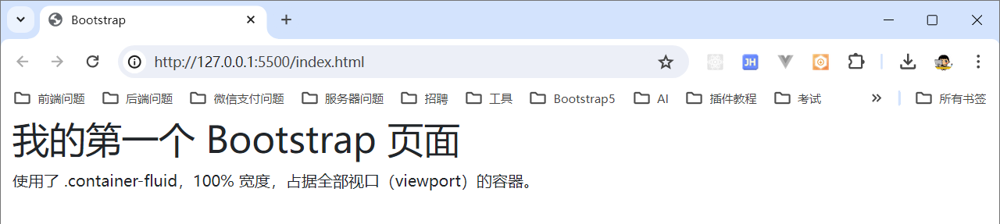

### 1.3 容器内边距（container pt-数字）

默认情况下，容器都有填充左右内边距，顶部和底部没有填充内边距。 Bootstrap 提供了一些间距类用于填充边距。 比如 .pt-5 就是用于填充顶部内边距：

```html
<div class="container pt-5">
  <h1>我的第一个 Bootstrap 页面</h1>
  <p>这是一些文本。</p> 
</div>
```

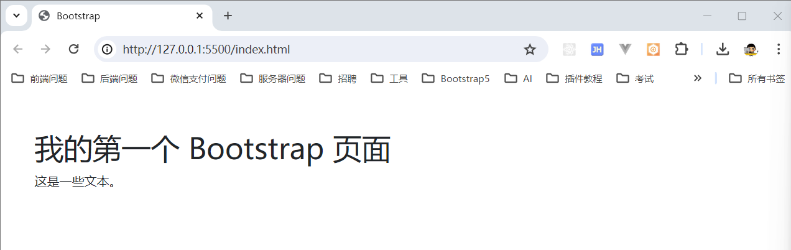

```html
<div class="container pt-2">
  <h1>我的第一个 Bootstrap 页面</h1>
  <p>这是一些文本。</p> 
</div>
```


**内边距（Padding）类**

- .p-*：设置元素所有方向的内边距大小级别，其中 * 表示大小级别（0 到 5）。
- .pt-*、.pb-*、.pl-*、.pr-*：分别设置元素顶部、底部、左侧和右侧的内边距大小级别。

**外边距（Margin）类**

- .m-*：设置元素所有方向的外边距大小级别，其中 * 表示大小级别（0 到 5）。
- .mt-*、.mb-*、.ml-*、.mr-*：分别设置元素顶部、底部、左侧和右侧的外边距大小级别。

**额外的间距类**

Bootstrap 5 还提供了一些额外的间距类，用于更精细地控制间距：

- .px-* 和 .py-*：分别设置元素水平方向（左右）和垂直方向（上下）的内边距或外边距大小级别。*
- .mx-* 和 .my-*：分别设置元素水平方向（左右）和垂直方向（上下）的外边距大小级别。

**自定义间距大小**

除了预设的间距大小级别外，Bootstrap 5 还允许你使用 Sass 变量（如 $spacer）来自定义间距大小。例如，你可以将 margin 或 padding 的大小设定为 $spacer 的某个倍数，如 .mt-3 表示将上方 margin 大小设定为 $spacer 的 3 倍。

### 1.4 容器的边框和颜色（border、bg-color、bg-primary） 

Bootstrap 也提供了一些边框（border）和颜色（bg-dark、bg-primary等）类用于设置容器的样式：

```html
<div class="container p-5 my-5 border">
  <h1>我的第一个 Bootstrap 页面</h1>
  <p>这个容器有一个边框和一些边距。</p>
</div>
    
<div class="container p-5 my-5 bg-dark text-white">
  <h1>我的第一个 Bootstrap 页面</h1>
  <p>这个容器具有深色背景色和白色文本，以及一些额外的边距。</p>
</div>
    
<div class="container p-5 my-5 bg-primary text-white">
  <h1>我的第一个 Bootstrap 页面</h1>
  <p>这个容器具有蓝色背景色和白色文本，以及一些额外的边距。</p>
</div>
```

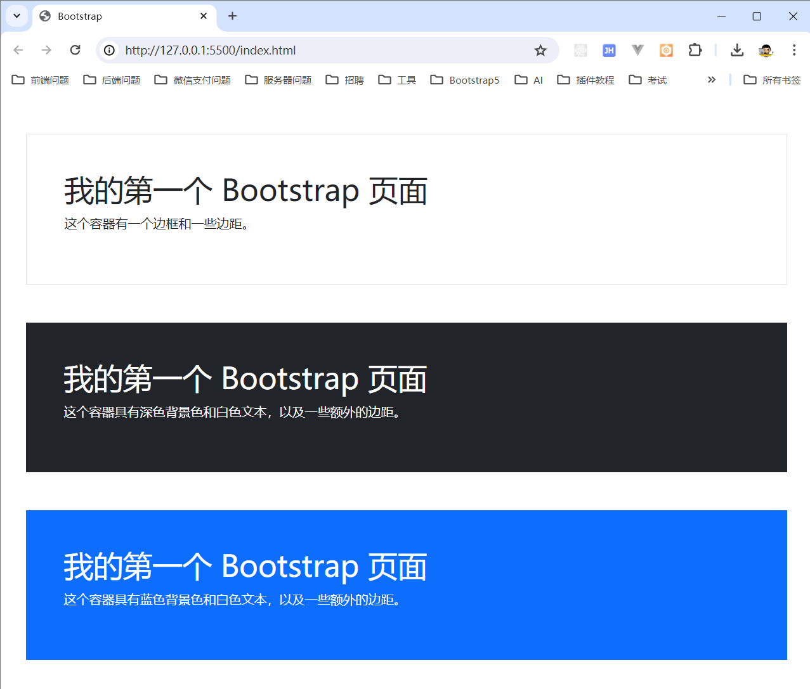

### 1.5 响应式容器（.container-sm|md|lg|xl） 

你可以使用 .container-sm|md|lg|xl 类来创建响应式容器。

容器的 max-width 属性值会根据屏幕的大小来改变。

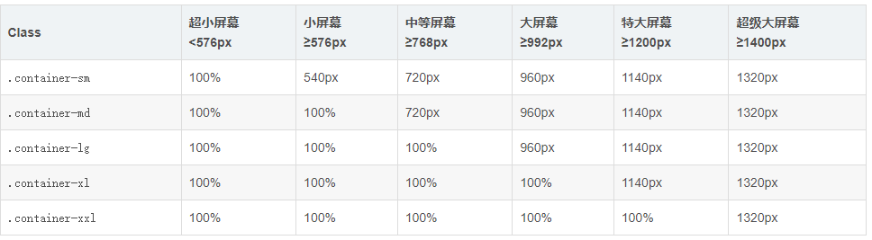

```html
<div class="container pt-3">
  <h1>响应式容器</h1>
  <p>重置浏览器大小查看效果.</p>
</div>
    
<div class="container-sm border">.container-sm</div>
<div class="container-md mt-3 border">.container-md</div>
<div class="container-lg mt-3 border">.container-lg</div>
<div class="container-xl mt-3 border">.container-xl</div>
<div class="container-xxl mt-3 border">.container-xxl</div>
```

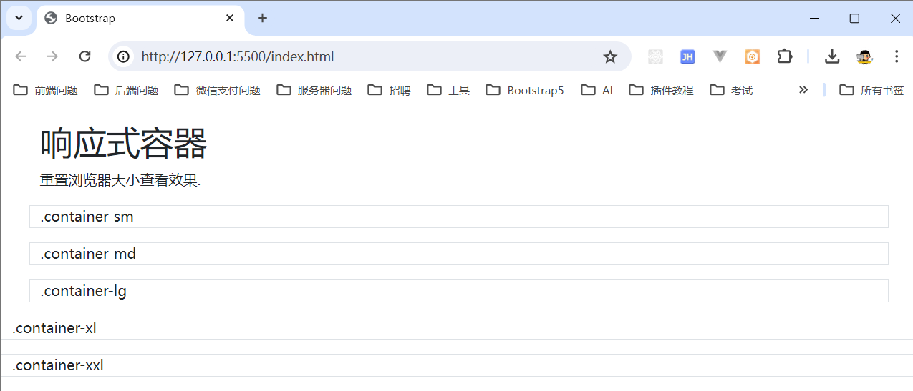

## 2、网格系统

Bootstrap 提供了一套响应式、移动设备优先的流式网格系统，随着屏幕或视口（viewport）尺寸的增加，系统会自动分为最多 12 列。

我们也可以根据自己的需要，定义列数：

### 2.1 网格类

Bootstrap 5 网格系统有以下 6 个类:

- .col- 针对所有设备。
- .col-sm- 平板 - 屏幕宽度等于或大于 576px。
- .col-md- 桌面显示器 - 屏幕宽度等于或大于 768px。
- .col-lg- 大桌面显示器 - 屏幕宽度等于或大于 992px。
- .col-xl- 特大桌面显示器 - 屏幕宽度等于或大于 1200px。
- .col-xxl- 超大桌面显示器 - 屏幕宽度等于或大于 1400px。

### 2.2 网格系统

Bootstrap5 网格系统规则:

- 网格每一行需要放在设置了 .container (固定宽度) 或 .container-fluid (全屏宽度) 类的容器中，这样就可以自动设置一些外边距与内边距。
- 使用行来创建水平的列组。
- 内容需要放置在列中，并且只有列可以是行的直接子节点。
- 预定义的类如 .row 和 .col-sm-4 可用于快速制作网格布局。
- 列通过填充创建列内容之间的间隙。 这个间隙是通过 .rows 类上的负边距设置第一行和最后一列的偏移。
- 网格列是通过跨越指定的 12 个列来创建。 例如，设置三个相等的列，需要使用三个 .col-sm-4 来设置。

### 2.3 创建相等宽度的列

```html
<div class="container-fluid mt-3">
  <h1>创建相等宽度的列</h1>
  <p>创建三个相等宽度的列! 尝试在 class="row" 的 div 中添加新的 class="col" div，会显示四个等宽的列。</p>
  <div class="row">
    <div class="col p-3 bg-primary text-white">.col</div>
    <div class="col p-3 bg-dark text-white">.col</div>
    <div class="col p-3 bg-primary text-white">.col</div>
  </div>
</div>
```

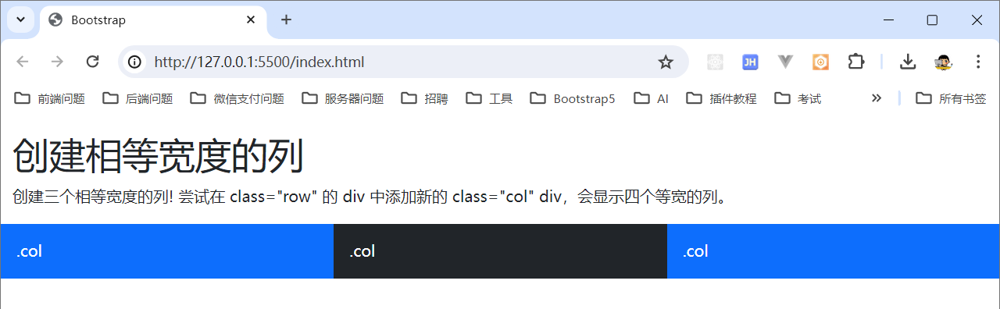

### 2.4 不等宽响应式列

以下实例演示了在平板及更大屏幕上创建不等宽度的响应式列。 **在移动设备上，即屏幕宽度小于 576px 时，两个列将会上下堆叠排版**:

```html
<div class="container-fluid mt-3">
  <h1>不等宽响应式列</h1>
  <p>重置浏览器大小查效果。</p>
  <p>在移动设备上，即屏幕宽度小于 576px 时，两个列将会上下堆叠排版。</p>
  <div class="row">
    <div class="col-sm-4 p-3 bg-primary text-white">.col</div>
    <div class="col-sm-8 p-3 bg-dark text-white">.col</div>
  </div>
</div>
```

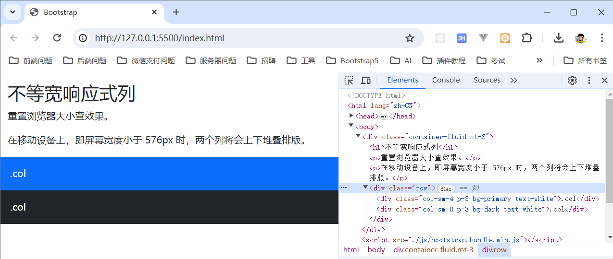

### 2.5 设置某一列宽度

如果只设置一列的宽度，其他列会自动均分剩下的宽度。 以下实例将列宽度为 25%、50%、25%：

```html
<div class="container-fluid mt-3">
  <h2>设置某一列宽度</h2>
  <p>如果只设置一列的宽度，其他列会自动均分剩下的宽度。 以下实例将列宽度为 25%、50%、25%：</p>
  <div class="row">
    <div class="col bg-success">.col</div>
    <div class="col-6 bg-warning">.col-6</div>
    <div class="col bg-success">.col</div>
  </div>
</div>
```

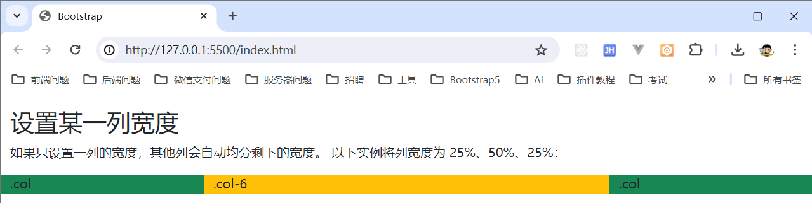

### 2.6 平板和桌面端

以下实例演示了在桌面设备的显示器上两个列的宽度各占 50%，如果在平板端则左边的宽度为 25%，右边的宽度为 75%, 在移动手机等小型设备上会堆叠显示。

```html
<div class="container-fluid mt-3">
  <h1>平板与桌面的网格布局</h1>
  <p>以下实例演示了在桌面设备的显示器上两个列的宽度各占 50%，如果在平板端则左边的宽度为 25%，右边的宽度为 75%, 在移动手机等小型设备上会堆叠显示。
</p>
  <p>重置浏览器窗口大小，查看效果。</p>
  <div class="row">
    <div class="col-sm-3 col-md-6 col-lg-4 col-xl-2 p-3 bg-primary text-white">.col</div>
    <div class="col-sm-9 col-md-6 col-lg-8 col-xl-10 p-3 bg-dark text-white">.col</div>
  </div>
</div>
```

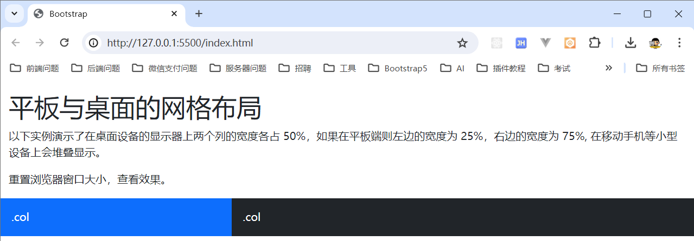

### 2.7 嵌套列

以下实例创建两列布局，其中一列内嵌套着另外两列：

```html
<div class="container-fluid">
  <div class="row">
    <div class="col-8 bg-warning p-4">
      .col-8
      <div class="row">
        <div class="col-6 bg-light p-2">.col-6</div>
        <div class="col-6 bg-secondary p-2">.col-6</div>
      </div>
    </div>
    <div class="col-4 bg-success p-4">.col-4</div>
  </div>
</div>
```

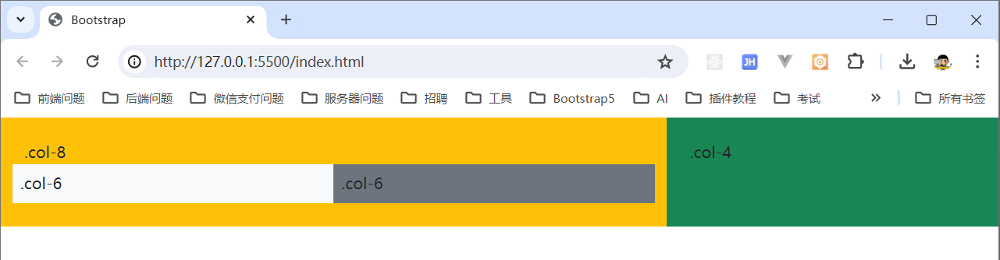

2.8 偏移列
偏移列通过 offset-*-* 类来设置。第一个星号( * )可以是 sm、md、lg、xl，表示屏幕设备类型，第二个星号( * )可以是 1 到 11 的数字。

为了在大屏幕显示器上使用偏移，请使用 .offset-md-* 类。这些类会把一个列的左外边距（margin）增加 * 列，其中 * 范围是从 1 到 11。

例如：.offset-md-4 是把.col-md-4 往右移了四列格。

```html
<div class="container-fluid mt-3">
  <h1>偏移列</h1>
  <p>.offset-md-4 是把.col-md-4 往右移了四列格。</p>
  <div class="row">
	  <div class="col-md-4 p-3 bg-primary text-white">.col-md-4</div>
	  <div class="col-md-4 offset-md-4 bg-dark text-white">.col-md-4 .offset-md-4</div>
	</div>
	<div class="row">
	  <div class="col-md-3 offset-md-3 bg-primary text-white">.col-md-3 .offset-md-3</div>
	  <div class="col-md-3 offset-md-3 bg-dark text-white">.col-md-3 .offset-md-3</div>
	</div>
	<div class="row">
	  <div class="col-md-6 offset-md-3 bg-primary text-white">.col-md-6 .offset-md-3</div>
	</div>
</div>
```

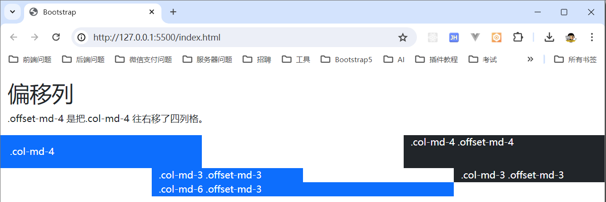

# 二、文字排版&颜色

## 1、文字排版

### 1.1 \<h1> -\<h6>

Bootstrap 中定义了所有的 HTML 标题（h1 到 h6）的样式。请看下面的实例：

```html
<div class="container mt-3">
  <p>字体大小会随着屏幕的变化而变化，可以重置浏览器大小查看效果。</p>
  <h1>h1 Bootstrap 标题</h1>
  <h2>h2 Bootstrap 标题</h2>
  <h3>h3 Bootstrap 标题</h3>
  <h4>h4 Bootstrap 标题</h4>
  <h5>h5 Bootstrap 标题</h5>
  <h6>h6 Bootstrap 标题</h6>
</div>
```

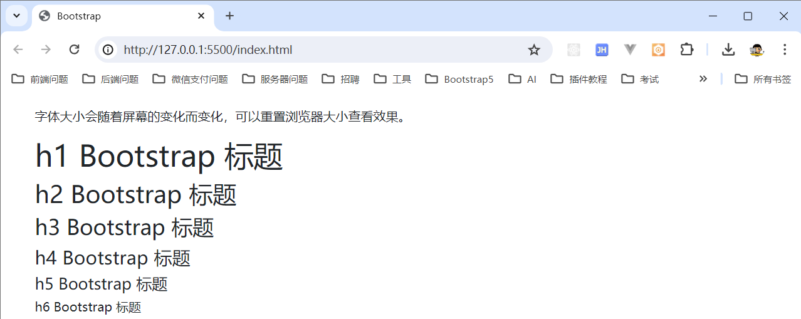

你也可以使用 .h1 到 .h6 类来设置元素的样式：

```html
<div class="container mt-3">
  <p>字体大小会随着屏幕的变化而变化，可以重置浏览器大小查看效果。</p>
  <p class="h1">h1 Bootstrap 标题</p>
  <p class="h2">h2 Bootstrap 标题</p>
  <p class="h3">h3 Bootstrap 标题</p>
  <p class="h4">h4 Bootstrap 标题 </p>
  <p class="h5">h5 Bootstrap 标题</p>
  <p class="h6">h6 Bootstrap 标题</p>
</div>
```

### 1.2 Display 标题类

Bootstrap 还提供了四个 Display 类来控制标题的样式: .display-1, .display-2, .display-3, .display-4

```html
<div class="container mt-3">
  <h1>Display 标题</h1>
  <p>Display 标题可以输出更大更粗的字体样式。</p>
  <h1 class="display-1">Display 1</h1>
  <h1 class="display-2">Display 2</h1>
  <h1 class="display-3">Display 3</h1>
  <h1 class="display-4">Display 4</h1>
  <h1 class="display-5">Display 5</h1>
  <h1 class="display-6">Display 6</h1>
</div>
```

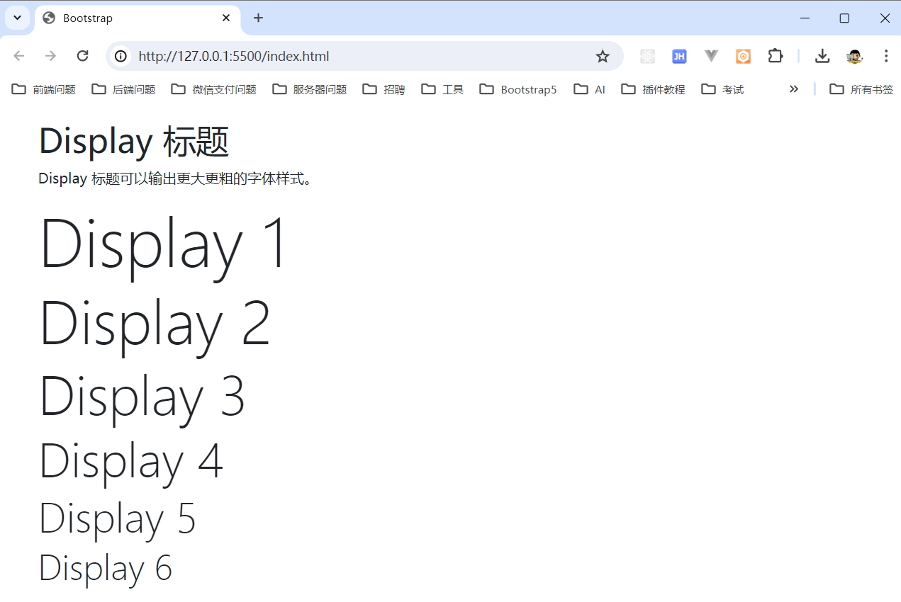

### 1.3 \<small>

在 Bootstrap 5 中 HTML <small> 元素用于创建字号更小的颜色更浅的文本:

```html
<div class="container mt-3">
  <h1>更小文本标题</h1>
  <p>small 元素用于字号更小的颜色更浅的文本:</p>       
  <h1>h1 标题 <small>副标题</small></h1>
  <h2>h2 标题 <small>副标题</small></h2>
  <h3>h3 标题 <small>副标题</small></h3>
  <h4>h4 标题 <small>副标题</small></h4>
  <h5>h5 标题 <small>副标题</small></h5>
  <h6>h6 标题 <small>副标题</small></h6>
</div>
```

**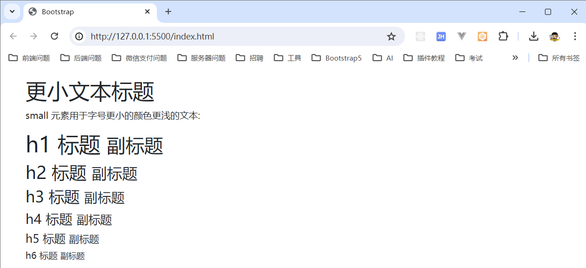**

### 1.4 \<mark>

Bootstrap 5 定义 <mark> 标签及 .mark 类为黄色背景及有一定的内边距

```html
<div class="container mt-3">
<h1>高亮文本</h1>
<p>用 mark 元素(或 .mark 类)来 <mark>高亮</mark> 文本。</p>
<p class="mark">高亮</p>
</div>
```

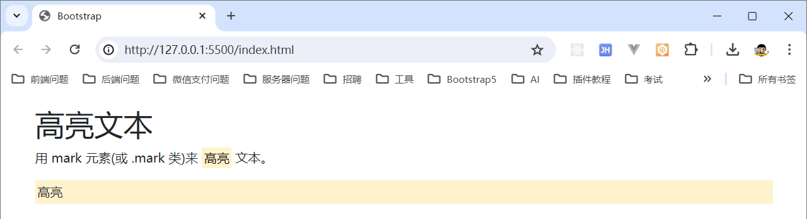

### 1.5 \<abbr>

Bootstrap 5 定义 HTML <abbr> 元素的样式为显示在文本底部的一条虚线边框

```html
<div class="container mt-3">
  <h1>关注博主</h1>
  <p>大家一起加油，努力学技术</p>
  <p>要保持<abbr title="World Health Organization">自信</abbr>呀，少年！！</p>
</div>
```

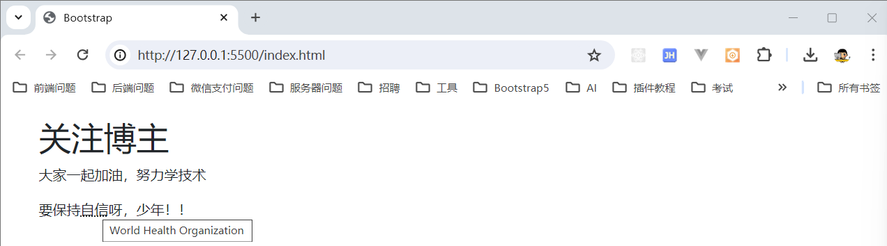

### 1.6 \<blockquote>

对于引用的内容可以在 <blockquote> 上添加 .blockquote 类 :

```html
<div class="container mt-3">
  <h1>Blockquotes</h1>
  <p>The blockquote element is used to present content from another source:</p>
  <blockquote class="blockquote">
    <p>For 50 years, WWF has been protecting the future of nature. The world's leading conservation organization, WWF works in 100 countries and is supported by 1.2 million members in the United States and close to 5 million globally.</p>
    <footer class="blockquote-footer">From WWF's website</footer>
  </blockquote>
</div>
```

### 1.7 \<dl>

Bootstrap 5 定义 HTML <dl> 元素的样式如下:

```html
<div class="container mt-3">
  <h1>Description Lists</h1>    
  <p>The dl element indicates a description list:</p>
  <dl>
    <dt>Coffee</dt>
    <dd>- black hot drink</dd>
    <dt>Milk</dt>
    <dd>- white cold drink</dd>
  </dl>     
</div>
```

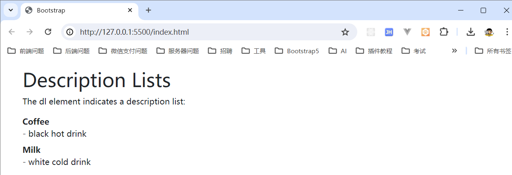

### 1.8 \<code>

Bootstrap 5 定义 HTML <code> 元素的样式如下:

```html
<div class="container mt-3">
  <h1>Code Snippets</h1>
  <p>Inline snippets of code should be embedded in the code element:</p>
  <p>The following HTML elements: <code>span</code>, <code>section</code>, and <code>div</code> defines a section in a document.</p>
</div>
```

### 1.9 \<kbd>

Bootstrap 5 定义 HTML <kbd> 元素的样式如下:

```html
<div class="container mt-3">
  <h1>Keyboard Inputs</h1>
  <p>To indicate input that is typically entered via the keyboard, use the kbd element:</p>
  <p>Use <kbd>ctrl + p</kbd> to open the Print dialog box.</p>
</div>
```

### 1.10 \<pre>

Bootstrap 5 定义 HTML <pre> 元素的样式如下:

```html
<div class="container mt-3">
    <h1>Multiple Code Lines</h1>
    <p>For multiple lines of code, use the pre element:</p>
    <pre>
        Text in a pre element
        is displayed in a fixed-width
        font, and it preserves
        both      spaces and
        line breaks.
    </pre>
</div>
```

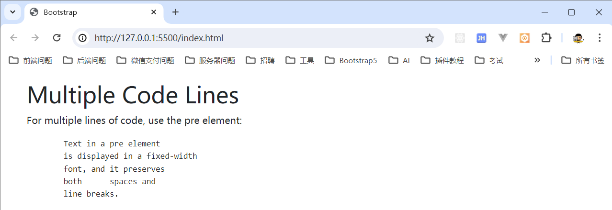

### 1.11 更多文字排版类

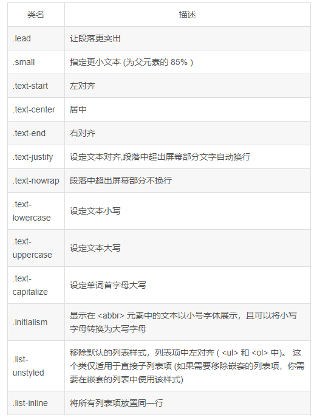

二、颜色
Bootstrap 5 提供了一些有代表意义的颜色类：.text-muted, .text-primary, .text-success, .text-info, .text-warning, .text-danger, .text-secondary, .text-white, .text-dark, .text-body (默认颜色，为黑色) and .text-light: 

```html
<div class="container mt-3">
  <div class="container">
  <h2>代表指定意义的文本颜色</h2>
  <p class="text-muted">柔和的文本。</p>
  <p class="text-primary">重要的文本。</p>
  <p class="text-success">执行成功的文本。</p>
  <p class="text-info">代表一些提示信息的文本。</p>
  <p class="text-warning">警告文本。</p>
  <p class="text-danger">危险操作文本。</p>
  <p class="text-secondary">副标题。</p>
  <p class="text-dark">深灰色文字。</p>
  <p class="text-body">默认颜色，为黑色。</p>
  <p class="text-light">浅灰色文本（白色背景上看不清楚）。</p>
  <p class="text-white">白色文本（白色背景上看不清楚）。</p>
  </div>
</div>
```

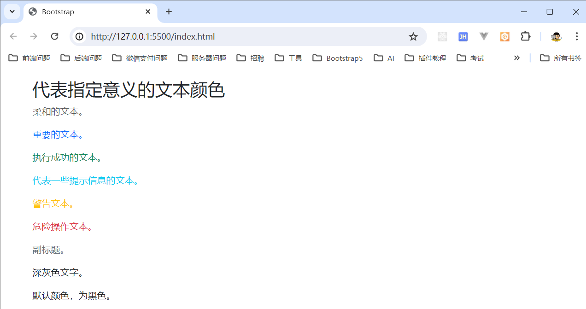

## 2、颜色透明度

可以设置文本颜色透明度为 50% ，使用 .text-black-50 或 .text-white-50 类:

```html
<div class="container mt-3">
  <h2>文本颜色透明度</h2>
  <p>可以设置文本颜色透明度为 50% ，使用 .text-black-50 或 .text-white-50 类:</p>
  <p class="text-black-50">透明度为 50% 的黑色文本，背景为白色。</p>
  <p class="text-white-50 bg-dark">透明度为 50% 的白色文本，背景为黑色。</p>
</div>
```

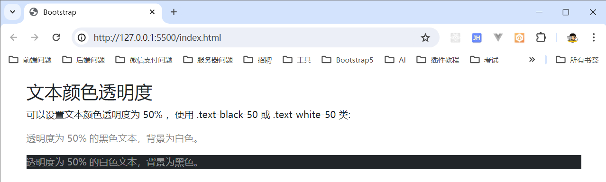

2.3 背景颜色
提供背景颜色的类有: .bg-primary, .bg-success, .bg-info, .bg-warning, .bg-danger, .bg-secondary, .bg-dark 和 .bg-light。

注意背景颜色不会设置文本的颜色，在一些实例中你需要与 .text-* 类一起使用。

```html
<div class="container mt-3">
  <div class="container">
  <h2>背景颜色</h2>
  <p class="bg-primary text-white">重要的背景颜色。</p>
  <p class="bg-success text-white">执行成功背景颜色。</p>
  <p class="bg-info text-white">信息提示背景颜色。</p>
  <p class="bg-warning text-white">警告背景颜色</p>
  <p class="bg-danger text-white">危险背景颜色。</p>
  <p class="bg-secondary text-white">副标题背景颜色。</p>
  <p class="bg-dark text-white">黑色背景颜色。</p>
  <p class="bg-light text-dark">浅灰背景颜色。</p>
  </div>
</div>
```

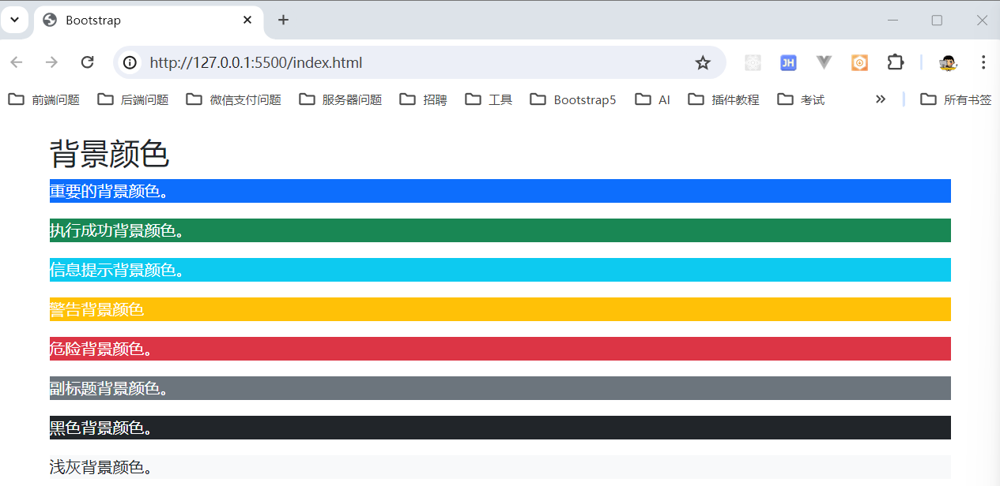

# 三、表格&图片

## 1、表格

### 1.1 基础表格

Bootstrap5 通过 .table 类来设置基础表格的样式，实例如下:

```html
<div class="container mt-3">
  <h2>基础表格</h2>
  <p>.table 类来设置基础表格的样式:</p>            
  <table class="table">
    <thead>
      <tr>
        <th>Firstname</th>
        <th>Lastname</th>
        <th>Email</th>
      </tr>
    </thead>
    <tbody>
      <tr>
        <td>John</td>
        <td>Doe</td>
        <td>john@example.com</td>
      </tr>
      <tr>
        <td>Mary</td>
        <td>Moe</td>
        <td>mary@example.com</td>
      </tr>
      <tr>
        <td>July</td>
        <td>Dooley</td>
        <td>july@example.com</td>
      </tr>
    </tbody>
  </table>
</div>
```

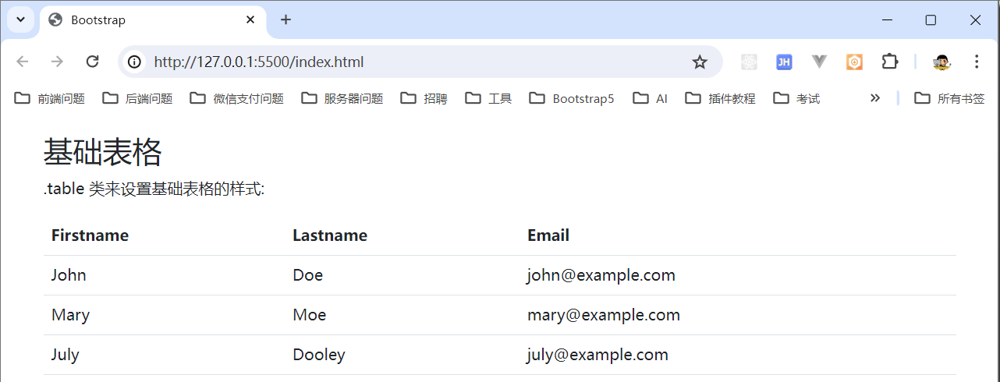

### 1.2 条纹表格

通过添加 .table-striped 类，您将在 **<tbody>** 内的行上看到条纹，如下面的实例所示：

```html
<div class="container mt-3">
  <h2>条纹表格</h2>
  <p>通过添加 .table-striped 类，来设置条纹表格:</p>            
  <table class="table table-striped">
    <thead>
      <tr>
        <th>Firstname</th>
        <th>Lastname</th>
        <th>Email</th>
      </tr>
    </thead>
    <tbody>
      <tr>
        <td>John</td>
        <td>Doe</td>
        <td>john@example.com</td>
      </tr>
      <tr>
        <td>Mary</td>
        <td>Moe</td>
        <td>mary@example.com</td>
      </tr>
      <tr>
        <td>July</td>
        <td>Dooley</td>
        <td>july@example.com</td>
      </tr>
    </tbody>
  </table>
</div>
```

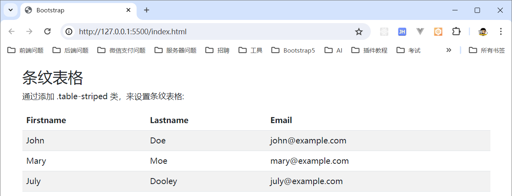

### 1.3 带边框表格

.table-bordered 类可以为表格添加边框

```html
<div class="container mt-3">
  <h2>带边框表格</h2>
  <p>.table-bordered 类可以为表格添加边框:</p>            
  <table class="table table-bordered">
    <thead>
      <tr>
        <th>Firstname</th>
        <th>Lastname</th>
        <th>Email</th>
      </tr>
    </thead>
    <tbody>
      <tr>
        <td>John</td>
        <td>Doe</td>
        <td>john@example.com</td>
      </tr>
      <tr>
        <td>Mary</td>
        <td>Moe</td>
        <td>mary@example.com</td>
      </tr>
      <tr>
        <td>July</td>
        <td>Dooley</td>
        <td>july@example.com</td>
      </tr>
    </tbody>
</table>
</div>
```

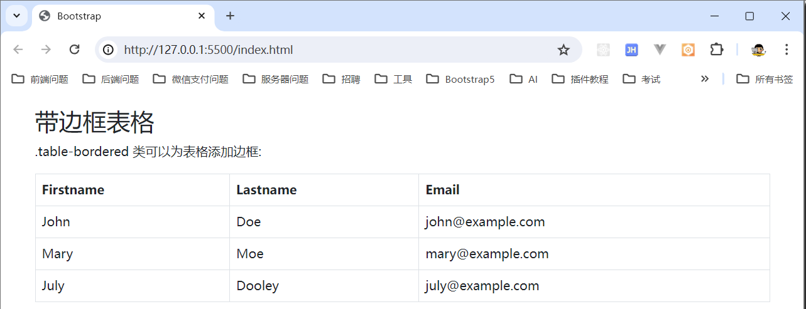

### 1.4 鼠标悬停状态表格

.table-hover 类可以为表格的每一行添加鼠标悬停效果（灰色背景）：

```html
<div class="container mt-3">
  <h2>鼠标悬停状态表格</h2>
  <p>.table-hover 类可以为表格的每一行添加鼠标悬停效果（灰色背景）：</p>            
  <table class="table table-hover">
    <thead>
      <tr>
        <th>Firstname</th>
        <th>Lastname</th>
        <th>Email</th>
      </tr>
    </thead>
    <tbody>
      <tr>
        <td>John</td>
        <td>Doe</td>
        <td>john@example.com</td>
      </tr>
      <tr>
        <td>Mary</td>
        <td>Moe</td>
        <td>mary@example.com</td>
      </tr>
      <tr>
        <td>July</td>
        <td>Dooley</td>
        <td>july@example.com</td>
      </tr>
    </tbody>
  </table>
</div>
```

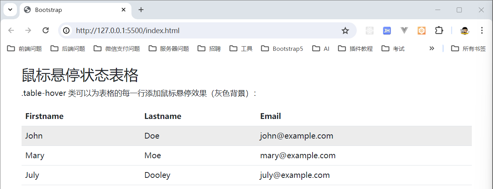

### 1.5 黑色背景表格

.table-dark 类可以为表格添加黑色背景：

```html
<div class="container mt-3">
  <h2>黑色背景表格</h2>
  <p>.table-dark 类可以为表格添加黑色背景：</p>            
  <table class="table table-dark">
    <thead>
      <tr>
        <th>Firstname</th>
        <th>Lastname</th>
        <th>Email</th>
      </tr>
    </thead>
    <tbody>
      <tr>
        <td>John</td>
        <td>Doe</td>
        <td>john@example.com</td>
      </tr>
      <tr>
        <td>Mary</td>
        <td>Moe</td>
        <td>mary@example.com</td>
      </tr>
      <tr>
        <td>July</td>
        <td>Dooley</td>
        <td>july@example.com</td>
      </tr>
    </tbody>
  </table>
</div>
```

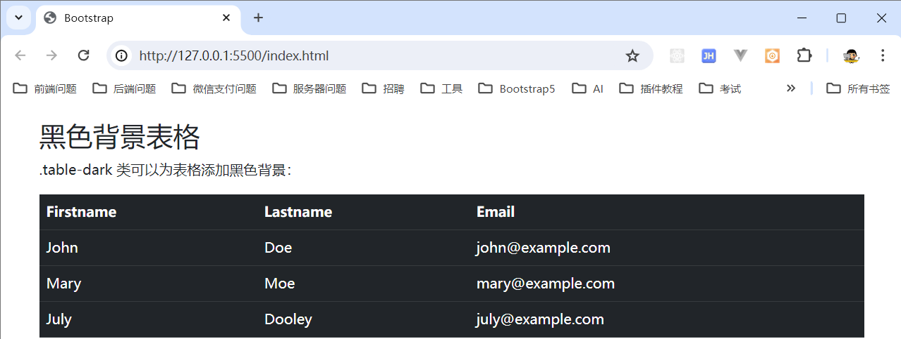

### 1.6 黑色条纹表格

联合使用 .table-dark 和 .table-striped 类可以创建黑色的条纹表格：

```html
<div class="container mt-3">
  <h2>黑色条纹表格</h2>
  <p>联合使用 .table-dark 和 .table-striped 类可以创建黑色的条纹表格：</p>            
  <table class="table table-dark table-striped">
    <thead>
      <tr>
        <th>Firstname</th>
        <th>Lastname</th>
        <th>Email</th>
      </tr>
    </thead>
    <tbody>
      <tr>
        <td>John</td>
        <td>Doe</td>
        <td>john@example.com</td>
      </tr>
      <tr>
        <td>Mary</td>
        <td>Moe</td>
        <td>mary@example.com</td>
      </tr>
      <tr>
        <td>July</td>
        <td>Dooley</td>
        <td>july@example.com</td>
      </tr>
    </tbody>
  </table>
</div>
```

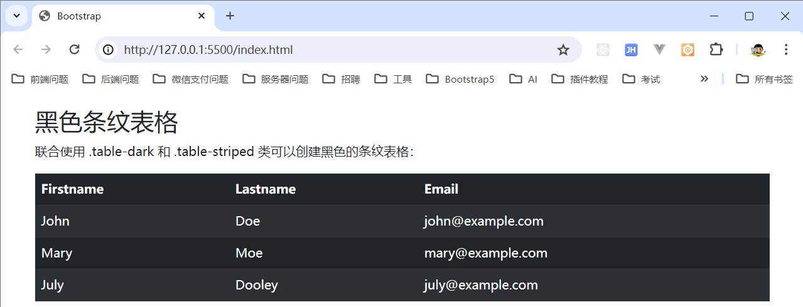

### 1.7 鼠标悬停效果 - 黑色背景表格

联合使用 .table-dark 和 .table-hover 类可以设置黑色背景表格的鼠标悬停效果：

```html
<table class="table table-dark table-hover">
    <thead>
      <tr>
        <th>Firstname</th>
        <th>Lastname</th>
        <th>Email</th>
      </tr>
    </thead>
    <tbody>
      <tr>
        <td>John</td>
        <td>Doe</td>
        <td>john@example.com</td>
      </tr>
      <tr>
        <td>Mary</td>
        <td>Moe</td>
        <td>mary@example.com</td>
      </tr>
      <tr>
        <td>July</td>
        <td>Dooley</td>
        <td>july@example.com</td>
      </tr>
    </tbody>
</table>
```

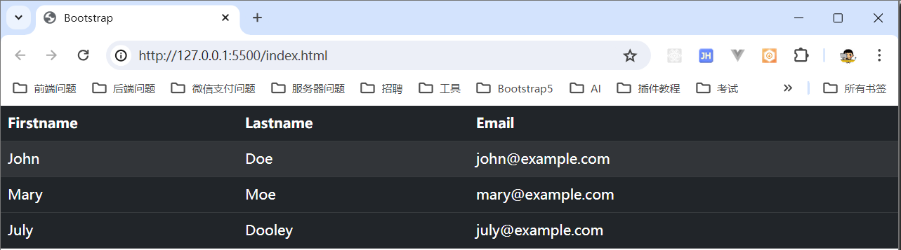

### 1.8 无边框表格

.table-borderless 类可以设置一个无边框的表格：

```html
<div class="container mt-3">
    <h2>无边框表格</h2>
    <p>.table-borderless 类可以设置一个无边框的表格：</p>
    <table class="table table-borderless">
        <thead>
            <tr>
                <th>Firstname</th>
                <th>Lastname</th>
                <th>Email</th>
            </tr>
        </thead>
        <tbody>
            <tr>
                <td>John</td>
                <td>Doe</td>
                <td>john@example.com</td>
            </tr>
            <tr>
                <td>Mary</td>
                <td>Moe</td>
                <td>mary@example.com</td>
            </tr>
            <tr>
                <td>July</td>
                <td>Dooley</td>
                <td>july@example.com</td>
            </tr>
        </tbody>
    </table>
</div>
```

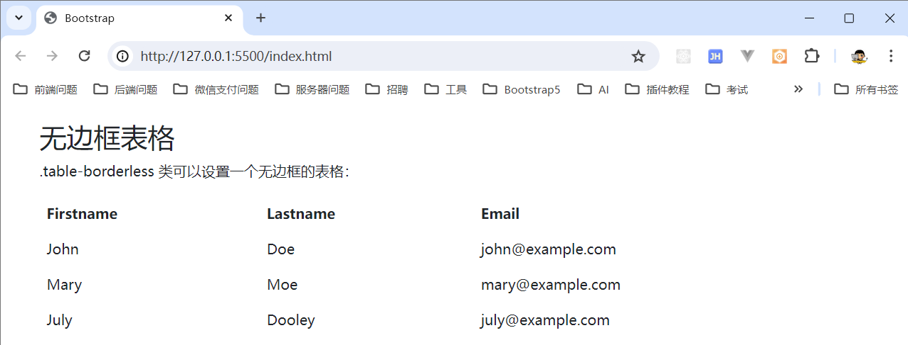

### 1.9 指定意义的颜色类

通过指定意义的颜色类可以为表格的行或者单元格设置颜色：

```html
<div class="container mt-3">
  <h2>指定意义的颜色类</h2>
  <p>通过指定意义的颜色类可以为表格的行或者单元格设置颜色：</p>            
  <table class="table">
    <thead>
      <tr>
        <th>Firstname</th>
        <th>Lastname</th>
        <th>Email</th>
      </tr>
    </thead>
    <tbody>
      <tr>
        <td>Default</td>
        <td>Defaultson</td>
        <td>def@somemail.com</td>
      </tr>      
      <tr class="table-primary">
        <td>Primary</td>
        <td>Joe</td>
        <td>joe@example.com</td>
      </tr>
      <tr class="table-success">
        <td>Success</td>
        <td>Doe</td>
        <td>john@example.com</td>
      </tr>
      <tr class="table-danger">
        <td>Danger</td>
        <td>Moe</td>
        <td>mary@example.com</td>
      </tr>
      <tr class="table-info">
        <td>Info</td>
        <td>Dooley</td>
        <td>july@example.com</td>
      </tr>
      <tr class="table-warning">
        <td>Warning</td>
        <td>Refs</td>
        <td>bo@example.com</td>
      </tr>
      <tr class="table-active">
        <td>Active</td>
        <td>Activeson</td>
        <td>act@example.com</td>
      </tr>
      <tr class="table-secondary">
        <td>Secondary</td>
        <td>Secondson</td>
        <td>sec@example.com</td>
      </tr>
      <tr class="table-light">
        <td>Light</td>
        <td>Angie</td>
        <td>angie@example.com</td>
      </tr>
      <tr class="table-dark text-dark">
        <td>Dark</td>
        <td>Bo</td>
        <td>bo@example.com</td>
      </tr>
    </tbody>
  </table>
</div>
```

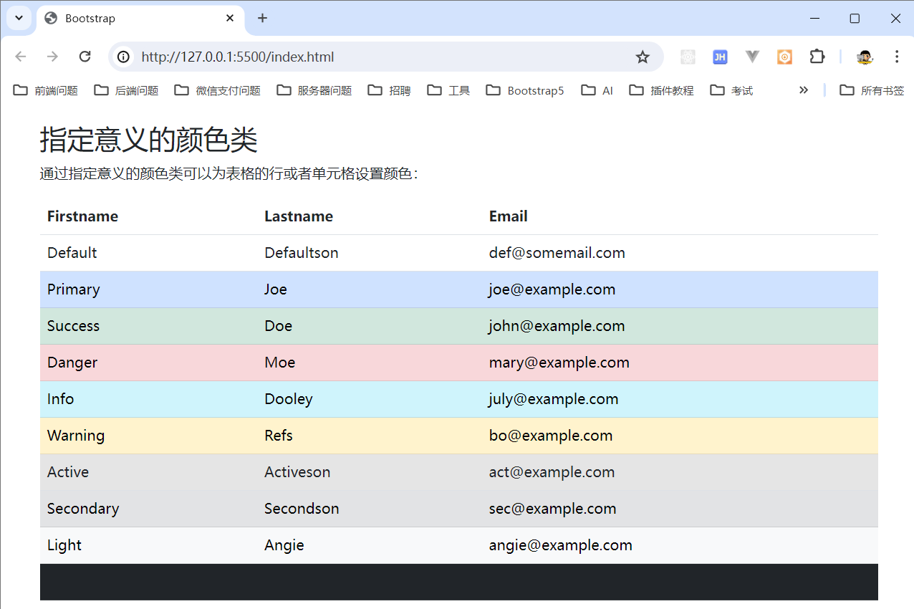

### 1.10 表头颜色

我们也可以设置表头的颜色，例如 .table-dark 类用于给表头添加黑色背景， .table-light 类用于给表头添加灰色背景:

```html
<div class="container mt-3">
  <h2>表头颜色</h2>
  <p>.table-dark 类用于给表头添加黑色背景，.table-light 类用于给表头添加灰色背景:</p>            
  <table class="table">
    <thead class="table-dark">
      <tr>
        <th>Firstname</th>
        <th>Lastname</th>
        <th>Email</th>
      </tr>
    </thead>
    <tbody>
      <tr>
        <td>John</td>
        <td>Doe</td>
        <td>john@example.com</td>
      </tr>
      <tr>
        <td>Mary</td>
        <td>Moe</td>
        <td>mary@example.com</td>
      </tr>
      <tr>
        <td>July</td>
        <td>Dooley</td>
        <td>july@example.com</td>
      </tr>
    </tbody>
  </table>
  <table class="table">
    <thead class="table-light">
      <tr>
        <th>Firstname</th>
        <th>Lastname</th>
        <th>Email</th>
      </tr>
    </thead>
    <tbody>
      <tr>
        <td>John</td>
        <td>Doe</td>
        <td>john@example.com</td>
      </tr>
      <tr>
        <td>Mary</td>
        <td>Moe</td>
        <td>mary@example.com</td>
      </tr>
      <tr>
        <td>July</td>
        <td>Dooley</td>
        <td>july@example.com</td>
      </tr>
    </tbody>
  </table>
</div>
```

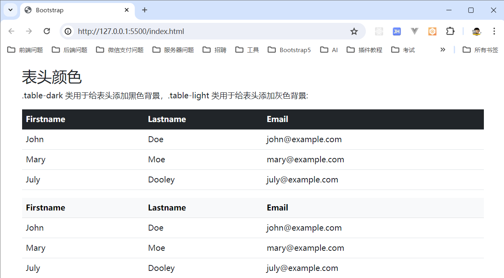

### 1.11 较小的表格

.table-sm 类用于通过减少内边距来设置较小的表格:

```html
<div class="container mt-3">
  <h2>较小的表格</h2>
  <p>.table-sm 类用于通过减少内边距来设置较小的表格:</p>            
  <table class="table table-bordered table-sm">
    <thead>
      <tr>
        <th>Firstname</th>
        <th>Lastname</th>
        <th>Email</th>
      </tr>
    </thead>
    <tbody>
      <tr>
        <td>John</td>
        <td>Doe</td>
        <td>john@example.com</td>
      </tr>
      <tr>
        <td>Mary</td>
        <td>Moe</td>
        <td>mary@example.com</td>
      </tr>
      <tr>
        <td>July</td>
        <td>Dooley</td>
        <td>july@example.com</td>
      </tr>
    </tbody>
  </table>
</div>
```

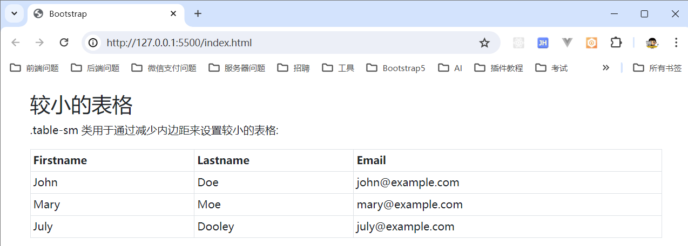

### 1.12 响应式表格

.table-responsive 类用于创建响应式表格：在屏幕宽度小于 992px 时会创建水平滚动条，如果可视区域宽度大于 992px 则显示不同效果（没有滚动条）:

```html
<div class="container mt-3">
  <h2>响应式表格</h2>
  <p>.table-responsive 类用于创建响应式表格：在屏幕宽度小于 992px 时会创建水平滚动条，如果可视区域宽度大于 992px 则显示不同效果（没有滚动条）:</p>                                                                                      
  <div class="table-responsive">          
  <table class="table">
    <thead>
      <tr>
        <th>#</th>
        <th>Firstname</th>
        <th>Lastname</th>
        <th>Age</th>
        <th>City</th>
        <th>Country</th>
        <th>Sex</th>
        <th>Example</th>
        <th>Example</th>
        <th>Example</th>
        <th>Example</th>
      </tr>
    </thead>
    <tbody>
      <tr>
        <td>1</td>
        <td>Anna</td>
        <td>Pitt</td>
        <td>35</td>
        <td>New York</td>
        <td>USA</td>
        <td>Female</td>
        <td>Yes</td>
        <td>Yes</td>
        <td>Yes</td>
        <td>Yes</td>
      </tr>
    </tbody>
  </table>
  </div>
</div>
```

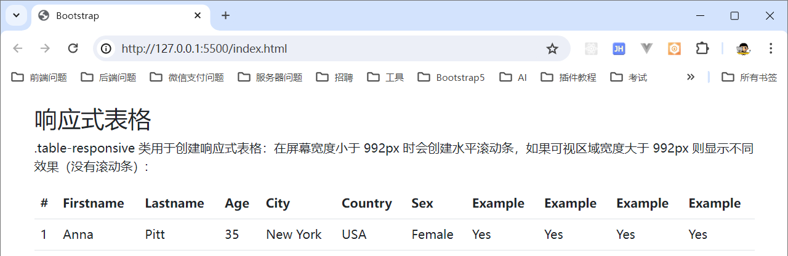

你可以通过以下类设定在指定屏幕宽度下显示滚动条：


## 2、图片

### 2.1 响应式图片

通过 Bootstrap 所提供的 `.img-fluid` 类让图片支持响应式布局。其原理是将 `max-width: 100%;` 和 `height: auto;` 赋予图片，以便随父元素的宽度变化一起缩放。

```html
  <div class="container mt-3">
    
  </div>
```


### 2.2 图片边框

可以使用 `.img-thumbnail` 使图片的外观具有 1px 宽度的圆形边框

```html
<div class="container mt-3">
  
</div>
```

### 2.3 图片对齐

```html
<div class="container mt-3">
    <!-- 左对齐 -->
    
 
    <!-- 居中对齐 -->
    
 
    <!-- 右对齐 -->
    
</div>
```


